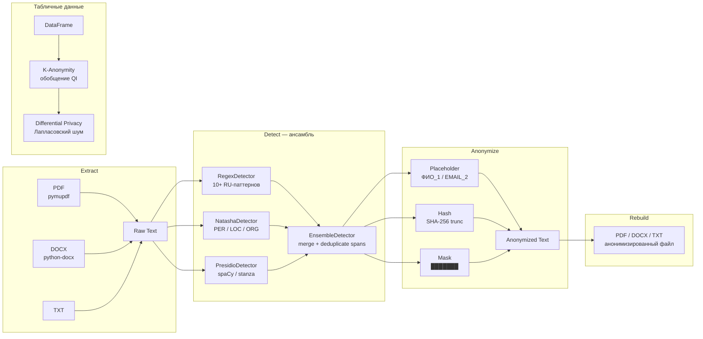

# Depermash — деперсонализатор PII-данных

Инструмент для удаления персональных данных из офисных документов и датасетов.  
Используется для подготовки данных к тестированию AI-агентов во внешнем контуре.

---

## Пайплайн



---

## Быстрый старт

```bash
# 1. Создать виртуальное окружение
python3 -m venv .venv && source .venv/bin/activate

# 2. Установить зависимости
pip install -r requirements.txt

# 3. Скачать spaCy-модели (для Presidio)
python -m spacy download ru_core_news_sm
python -m spacy download en_core_web_sm

# 4. Запустить демо
python demo.py
```

---

## Использование

### Анонимизация текста

```python
from depersonalizer import Depersonalizer

dp = Depersonalizer(mode="placeholder")   # placeholder | hash | mask
text = "Иванов Иван, тел. +7-900-123-45-67, паспорт 4510 123456"
print(dp.anonymize_text(text))
# -> 'Иванов Иван, тел. [ТЕЛЕФОН_1], паспорт [ПАСПОРТ_1]'

print(dp.get_report())
# {'total_entities': 2, 'mapping': {'+7-900-123-45-67': '[ТЕЛЕФОН_1]', ...}}
```

### Анонимизация файла

```python
dp.anonymize_file("input.pdf",  "output_anon.pdf")
dp.anonymize_file("input.docx", "output_anon.docx")
dp.anonymize_file("input.txt",  "output_anon.txt")
```

### K-анонимность (датасет)

```python
import pandas as pd
from depersonalizer import KAnonymityProcessor

kp     = KAnonymityProcessor(k=3)
df_anon = kp.process(
    df,
    quasi_ids=["age", "zip_code", "birth_date"],
    strategies={"age": "age_range", "zip_code": "zip_prefix", "birth_date": "year_only"},
)
```

### Дифференциальная приватность

```python
from depersonalizer import DifferentialPrivacyProcessor

dp_proc = DifferentialPrivacyProcessor(epsilon=1.0, sensitivity=20_000)
df_noisy = dp_proc.add_noise(df, numeric_columns=["salary", "age"])
```

---

## Архитектура модулей

| Класс | Описание |
|---|---|
| `RegexDetector` | 10+ паттернов: телефон, email, паспорт, СНИЛС, ИНН, карта, IP, URL, IBAN, дата |
| `NatashaDetector` | Russian NER: PER / LOC / ORG (natasha) |
| `PresidioDetector` | Multilingual NER via Presidio (spaCy или stanza backend) |
| `EnsembleDetector` | Объединяет все детекторы, разрешает перекрывающиеся spans |
| `TextAnonymizer` | Заменяет spans: placeholder / hash (SHA-256) / mask |
| `EntityTracker` | Ведёт реестр оригинал→плейсхолдер, гарантирует последовательные ID |
| `KAnonymityProcessor` | k-анонимность для pandas DataFrame (обобщение QI) |
| `DifferentialPrivacyProcessor` | Лапласовский шум для числовых столбцов (ε-DP) |
| `PDFProcessor` | Extract + Rebuild для PDF (pymupdf redact API) |
| `DocxProcessor` | Extract + Rebuild для DOCX (runs + поколонные таблицы) |
| `Depersonalizer` | Главный класс-оркестратор |

---

## Что обнаруживается

| Тип | Примеры | Детектор |
|---|---|---|
| ФИО | «Иванов Иван Петрович» | Natasha NER, Presidio |
| Телефон | `+7-900-123-45-67`, `8(800)555-35-35` | Regex |
| Email | `ivan@sber.ru` | Regex, Presidio |
| Паспорт РФ | `4510 123456` | Regex |
| СНИЛС | `123-456-789 01` | Regex |
| ИНН | `770100123456` | Regex |
| Банк. карта | `4276 1234 5678 9012` | Regex |
| Дата рождения | `15.06.1990`, `1990-06-15` | Regex, Presidio |
| IBAN | `RU02044...` | Regex |
| IP-адрес | `192.168.1.100` | Regex, Presidio |
| URL | `https://lk.bank.ru/...` | Regex |
| Адрес / Локация | «Москва», «Санкт-Петербург» | Natasha NER, Presidio |
| Организация | «ОАО Газпром», «МФЦ» | Natasha NER, Presidio |

---

## Зависимости

```
numpy         — Лапласовский шум (DP)
pandas        — K-анонимность, табличные данные
natasha       — Russian NER
presidio-*    — Multilingual NER framework
spacy         — NLP engine для Presidio
stanza        — Альтернативный NLP engine (опционально)
pymupdf       — Обработка PDF
python-docx   — Обработка DOCX
```

